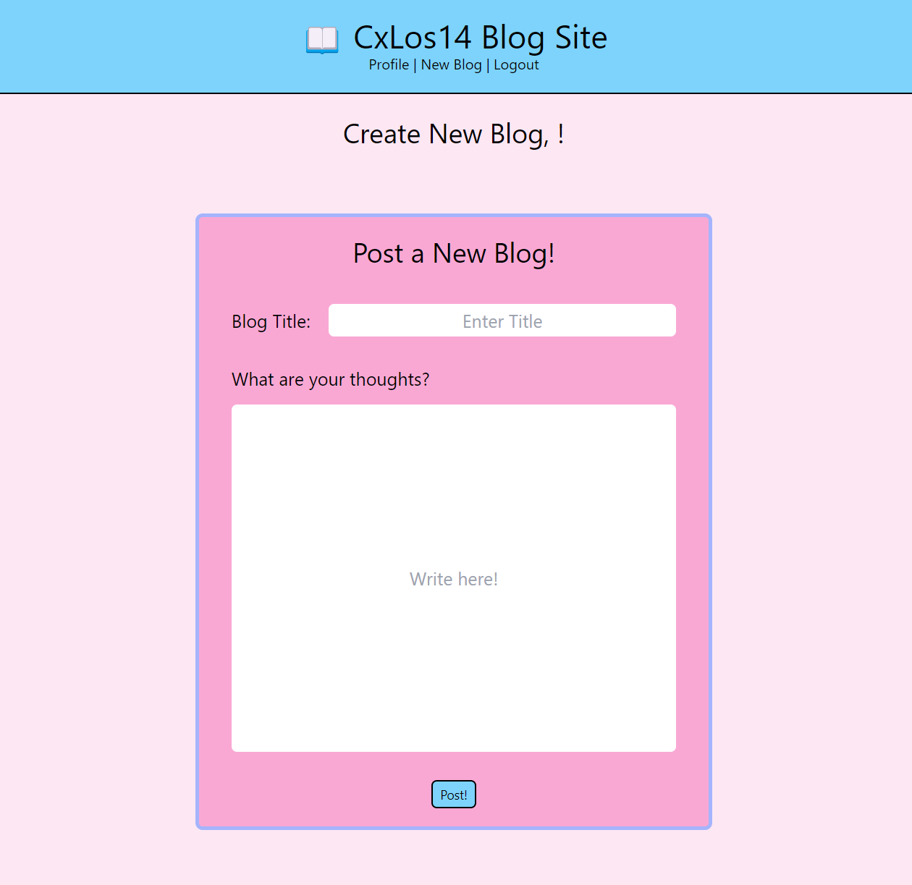

# CxLos14-CMS-BlogSite

## Description

```
The motivation behind building this was to fully integrate everything we have learned in class so far to build my first full stack application. I made this application so that users can sign in and create an account for a blog site where they can share and post their thoughts. This app isn't so much a problem solver like some of my other apps, but more so a fun interactive social media-like site. Building this project, I learned the importance of having all of your routes set up correctly as it can easily get very confusing and make your site crash. I learned how to integrate all aspects of the MVC model to make a fully functional site. I also learned how tricky it is deploying to Heroku and figured out that file structure is case sensitive so it is very important to make sure everything matches 100%.
```

## Table of Contents 
	
- [Installation](#installation)
- [Usage](#usage)
- [Credits](#credits)
- [License](#license)
- [Badges](#badges)
- [Features](#features)
- [Tests](#tests)


## Installation


## Usage


[CxLos14 Blog Site](https://cxlos14-cms-blogsite.herokuapp.com)



## Badges

N/A

## Features

N/A

## How to Contribute

N/A

## Tests

N/A

## Credits

N/A

## License

MIT License

Copyright (c) 2022 CxLos

Permission is hereby granted, free of charge, to any person obtaining a copy
of this software and associated documentation files (the "Software"), to deal
in the Software without restriction, including without limitation the rights
to use, copy, modify, merge, publish, distribute, sublicense, and/or sell
copies of the Software, and to permit persons to whom the Software is
furnished to do so, subject to the following conditions:

The above copyright notice and this permission notice shall be included in all
copies or substantial portions of the Software.

THE SOFTWARE IS PROVIDED "AS IS", WITHOUT WARRANTY OF ANY KIND, EXPRESS OR
IMPLIED, INCLUDING BUT NOT LIMITED TO THE WARRANTIES OF MERCHANTABILITY,
FITNESS FOR A PARTICULAR PURPOSE AND NONINFRINGEMENT. IN NO EVENT SHALL THE
AUTHORS OR COPYRIGHT HOLDERS BE LIABLE FOR ANY CLAIM, DAMAGES OR OTHER
LIABILITY, WHETHER IN AN ACTION OF CONTRACT, TORT OR OTHERWISE, ARISING FROM,
OUT OF OR IN CONNECTION WITH THE SOFTWARE OR THE USE OR OTHER DEALINGS IN THE
SOFTWARE.
